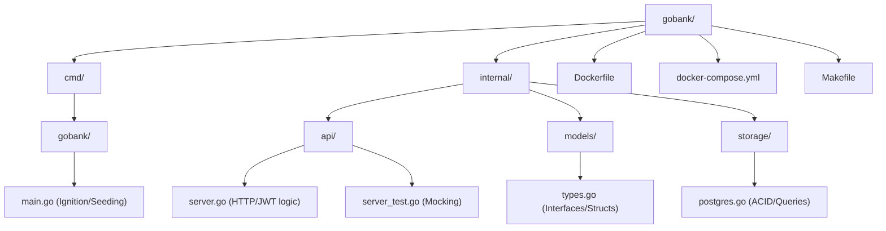

# Go Bank API


An enterprise-grade, fully orchestrated REST API built in Go for handling core banking operations. This backend system handles accounts, secure atomic transfers, JWT & Bcrypt authentication, and utilizes raw PostgreSQL ACID transactions for bulletproof data management.

## Project Context

> **Architectural Sandbox:** This repository serves as an advanced learning step and foundational architecture testbed. It was designed to establish and master scalable patterns in Go (Official Standard Layout, Clean Architecture, Dockerization) to bridge the gap between basic backend tutorials and production-grade software engineering.

## Directory Structure



## Key Architectural Features

- **Standard Go Project Layout**: Refactored from a flat structure into strict `cmd/` and `internal/` domains, ensuring one-way dependency flow and absolute package isolation.
- **ACID Database Transactions**: Financial transfers utilize PostgreSQL `tx.Begin()`, `tx.Commit()`, and `tx.Rollback()` to protect against race conditions and mid-transfer network crashes.
- **Automated Mock Testing**: Implements `net/http/httptest` and interface dependency injection to test API logic natively in-memory without booting the full server.
- **Cryptographic Authentication**: Mandates `golang.org/x/crypto/bcrypt` hashing for database credentials and requires self-signed JWT Headers for secure resource access.
- **Multi-Stage Orchestration**: Packaged via Docker Compose using an ultra-lightweight compiled `golang:alpine` container networked to a persistent PostgreSQL volume.

---

## Tech Stack

- **Language**: Go 1.22+
- **Router**: Gorilla Mux
- **Database**: PostgreSQL 15
- **Security**: JWT (v5) & Bcrypt
- **Testing**: Testify
- **Infrastructure**: Docker & Docker Compose

---

## Getting Started (Quick Run)

You can launch the entire Database and API cluster seamlessly using the built-in Makefile.

### 1. Boot the Architecture
```bash
# This automatically builds the Alpine Linux container and connects Postgres
make docker-up
```

### 2. View Backend Logs
```bash
docker-compose logs -f
```

### 3. Teardown
```bash
make docker-down
```

---

## Developer Workflow

If you want to run the codebase locally natively (without Docker) to iterate fast:

```bash
# Boot a local database instance
docker run --name some-postgres -e POSTGRES_USER=postgres -e POSTGRES_PASSWORD=mysecretpassword -e POSTGRES_DB=postgres -p 5432:5432 -d postgres

# Run the API and automatically seed the database with testing dummy accounts!
go run ./cmd/gobank --seed

# Run the automated unit testing suite
make test
```
